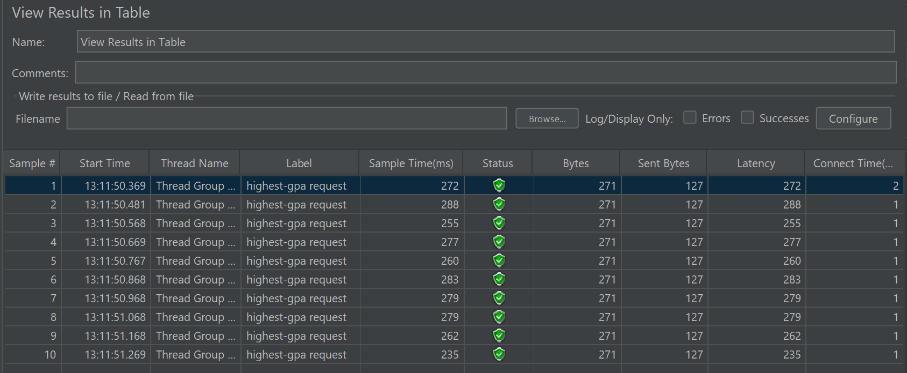
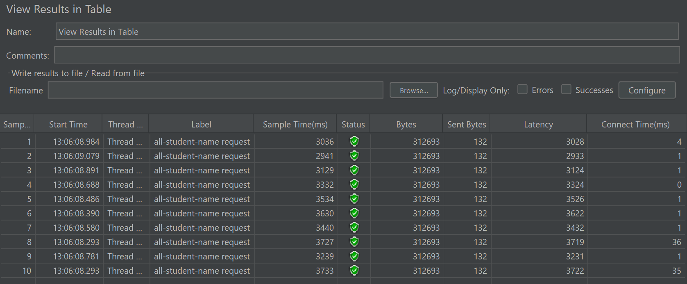
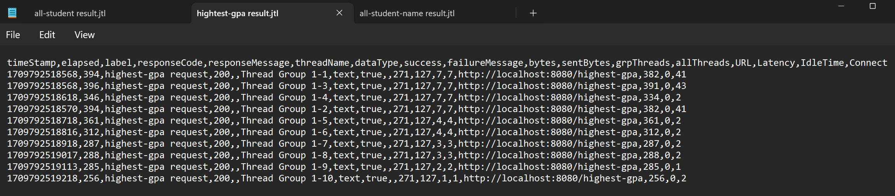
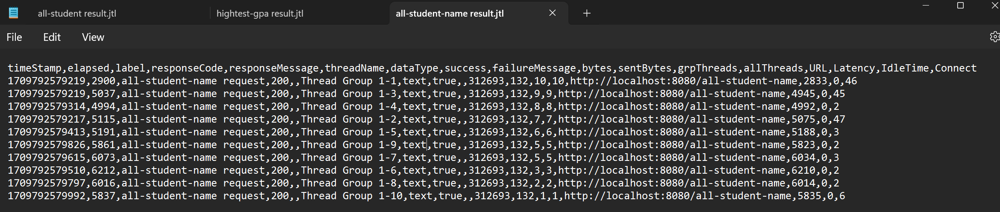
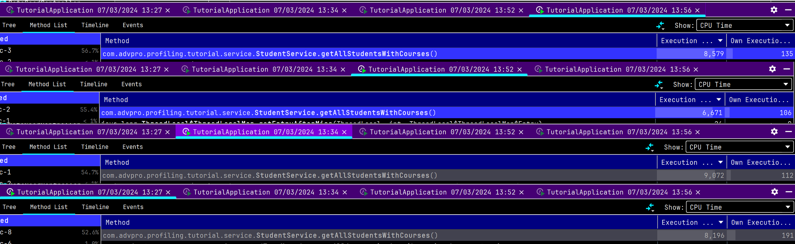
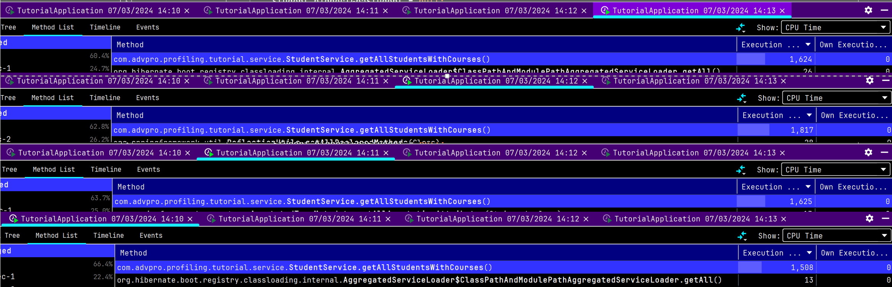

# what is this

i don't know

## Screen capture
### performance test with GUI

Results of performance testing for endpoint **'/highest-gpa'** using GUI

Results of performance testing for endpoint **'/all-student-name'** using GUI

### performance test with command-line

Results of performance testing for endpoint **'/highest-gpa'** using command-line

Results of performance testing for endpoint **'/all-student-name'** using command-line

### optimizing /all-student

Comparison of before optimization and after optimization,
which shows an ~81% reduction in CPU time (8.5s -> 1.6s).
More tests shown below which verify the times.

Sample of 4 tests before optimizing **'/all-student'** endpoint. 
Average CPU time for the method is ~8 seconds

Sample of 4 tests after optimizing **'/all-student'** endpoint. 
Average CPU time for the method is ~1.6 seconds, which is an ~80% reduction in CPU time

## Reflection 1
ans:
- What is the difference between the approach of performance testing with JMeter and profiling with IntelliJ Profiler in the context of optimizing application performance?
> lorem ipsum dolor
- How does the profiling process help you in identifying and understanding the weak points in your application?
> sit amet consectetur
- Do you think IntelliJ Profiler is effective in assisting you to analyze and identify bottlenecks in your application code?
> adipiscing elit sed
- What are the main challenges you face when conducting performance testing and profiling, and how do you overcome these challenges?
> do eiusmod tempor
- What are the main benefits you gain from using IntelliJ Profiler for profiling your application code?
> incididunt ut labore
- How do you handle situations where the results from profiling with IntelliJ Profiler are not entirely consistent with findings from performance testing using JMeter?
> et dolore magna aliqua
- What strategies do you implement in optimizing application code after analyzing results from performance testing and profiling? How do you ensure the changes you make do not affect the application's functionality?
> Ut enim ad minim

## Checklist
- [x] Commit your source code into your main branch in your repository
- [x] Create 2 other test plan for endpoints /all-student-name and /highest-gpa. Perform performance testing as has been done above. Take a screenshot of the results and place it in the README.md file
- [x] Run both test plans that you have previously created (for endpoint /highest-gpa and /all-student-name) using the command line, take a screenshot of the results, and include them in the README.md file.
- [x] Refactor that code to achieve better performance. Commit in a new branch named “optimize”. Create representative commit messages. Do not use commit messages like "OK", "Cool", "Great", but instead create commit messages like "[Refactoring] - Optimizing method getAllStudentWithCourse".
- [ ] Perform the profiling process and optimizing the code for others endpoint (/all-student-name and /highest-gpa). Also achieve a 20% performance improvement for both of those endpoints. Commit in “optimize” branch also create representative commit messages. Do not use commit messages like "OK", "Cool", "Great", but instead create commit messages like "[Refactoring] - Optimizing method getAllStudentWithCourse".
- [ ] After the profiling and performance optimization process is completed, perform a performance test again using JMeter, see the results, and compare with the first measurement. Is there an improvement from JMeter measurements? Write your conclusion in the README.md file.

